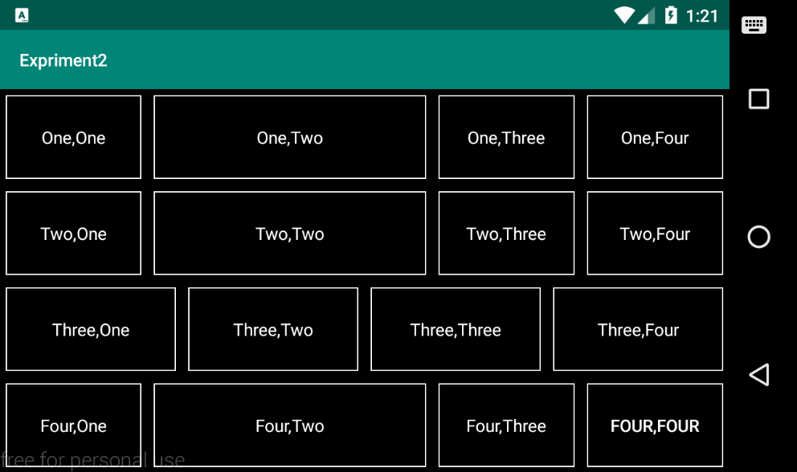
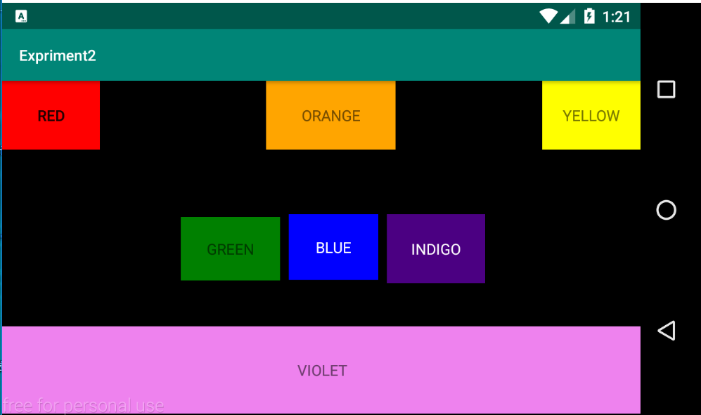
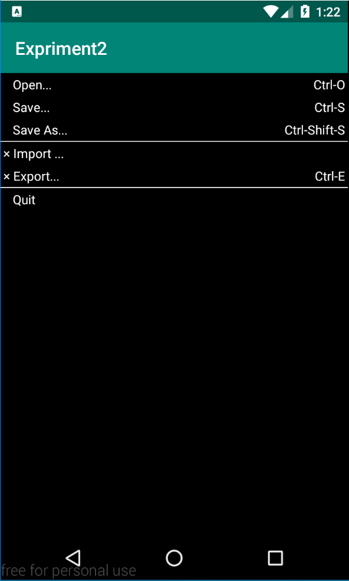

# Expriment2
## 安卓移动开发实验二
Android布局：线性布局 约束布局 表格布局

### 线性布局关键代码：
```
  //一个模块
  <LinearLayout
        android:layout_width="match_parent"
        android:layout_height="0dp"
        android:layout_weight="1">
        <TextView
            android:layout_width="0dp"
            android:layout_weight="1"
            android:layout_height="match_parent"
            android:gravity="center"
            android:layout_margin="5dp"
            android:background="@drawable/textview_border"
            android:textColor="@color/white"
            android:text="One,One"
            />
  </LinearLayout>
  //设置了右下角块为跳转按钮，跳转到约束布局界面
  public class MainActivity extends AppCompatActivity {
    private Button btn1;
    @Override
    protected void onCreate(Bundle savedInstanceState) {
        super.onCreate(savedInstanceState);
        setContentView(R.layout.activity_main);
        btn1 = (Button) findViewById(R.id.btn1);
        btn1.setOnClickListener(new View.OnClickListener(){
            @Override
            public void onClick(View v){
                Intent i = new Intent(MainActivity.this , SecondActivity.class);
                startActivity(i);
            }
        });

    }
}
 ```
 运行截图：
 
 
### 约束布局关键代码：
```
   //一个模块 同时把RED块设置为按钮 跳转到表格布局界面 操作同上
   <TextView
          android:id="@+id/textView3"
          android:layout_width="120dp"
          android:layout_height="0dp"
          android:layout_marginEnd="136dp"
          android:layout_marginRight="136dp"
          android:layout_marginBottom="60dp"
          android:text="ORANGE"
          android:gravity="center"
          android:background="@color/orange"
          app:layout_constraintBottom_toTopOf="@+id/textView6"
          app:layout_constraintEnd_toStartOf="@+id/textView2"
          app:layout_constraintTop_toTopOf="parent" />
```
 运行截图：
  
 
### 表格布局关键代码：
```
//边框
<TableRow>
      <TextView
          android:layout_height="1dp"
          android:background="@color/white"/>
      <TextView
          android:layout_height="1dp"
          android:background="@color/white"/>
</TableRow>
//一行单元格
<TableRow>
      <TextView
          android:text="× Import ..."
          android:textColor="@color/white"
          android:padding="3dp" />
</TableRow>
```
 运行截图：
 
 

 
